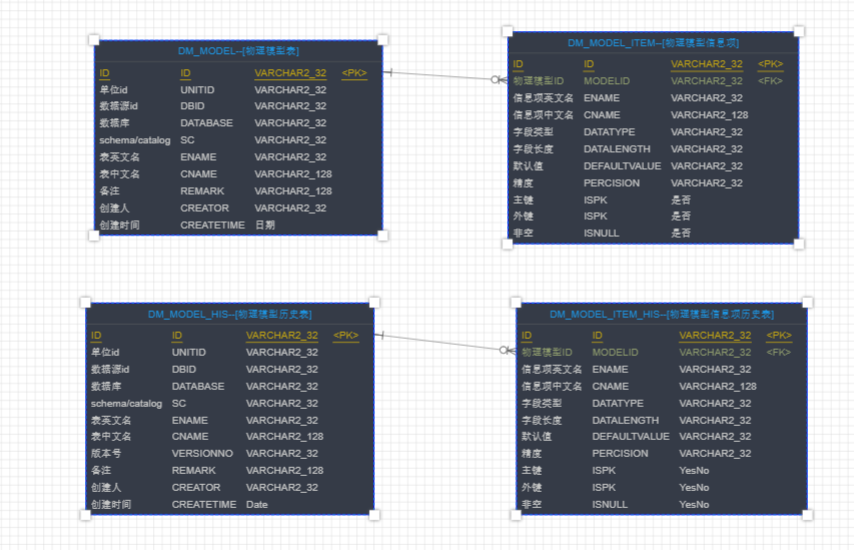

## 1.介绍
本项目是将实际开发中学习到的业务知识，设计了一个数据治理demo项目，
旨在实现基础的权限控制，数据源管理，元数据采集，数据质量检查，数据脱敏功能。
## 2.技术选型
vue + element-ui + router + axios  
SpringBoot + Mybatis + Druid + Swagger + Redis + git
## 3.功能设计
### 3.1 用户权限管理
（1）设计思路

    1.超级管理员登录，新建单位，新建单位管理员
    2.单位管理员登录会看到所有该单位下用户，以及申请注册页面,管理员有授权,重置密码功能
    3.普通用户访问注册界面，注册账号，提交申请，单位管理员对申请进行审批
    4.如果审批通过将申请用户分组，分成角色组的目的是给用户组授予不同的界面菜单，从而实现部分的权限控制，类似于oracle用户管理
    5.普通业务用户登录，即可加载该角色组的菜单

（2）库表设计

（3）功能流程设计

### 3.2 数据源管理
（1）设计思路

    1.数据源管理的基础增删改查功能
    2.按照单位级权限展示数据源
    3.增加测试连接功能，填写完数据源信息后能方便测试
    4.数据源进行分类，分为采集元数据、采集数据、写入质量结果，写入脱敏结果，
    5.因为质量检查结果需要记录错误数据，脱敏结果也需要记录脱敏后数据，所以设置一个数据源下一个schema/catalog对应一个结果库
    6.根据数据源分类，可以将数据源进行绑定，即四种类型数据为一组。在完成质量检查、脱敏服务后会自动将结果保存在对应的库中
    
（2）库表设计

    

### 3.3 元数据采集，版本比对，物理模型，逻辑模型
（1）设计思路

    1.元数据采集方式包括PDM/EXCEL方式导入，数据库直连导入
    2.数据库直连包括JDBC的API方式采集，也可以通过查询数据库系统库，用sql方式筛选元数据采集，
        这种采集方式是防止连接用户仅有选择数据的权限
    3.设计主子表，主表存物理模型，子表存物理模型信息项
    4.每次采集，一张表存放最新数据，另一张表存放全量数据。最新数据用于展示，全量数据用于版本比对
    5.历史表数据量可能较大，设计索引结构，加快查询速度
    6.设计逻辑模型映射，
        正向创建逻辑模型，在界面新建一个逻辑模型，通过界面拉线实现逻辑模型字段和物理模型字段的映射
        反向创建逻辑模型，先找一些实际的物理表，将其中元数据字段提取出来，去重后组成逻辑模型，逻辑模型的字段值即为各物理模型的绑定值
        
 细节问题注意
 
    1.oracle的varchar2(n)和varchar2(n char)类型在oracle中会自动将n char类型转为n*4的字节长度，如果需要精确值，那么需要
    用到DBA_TAB_COLUMNS表中
        DATA_LENGTH字段，真实的字段长度，单位为字节
        CHAR_LENGTH字段，以字符显示列的长度，此值仅适用于以下数据类型：CHAR、VARCHAR2、NCHAR、NVARCHAR2
        CHAR_USED字段，指示该列使用BYTE长度语义（B）或CHAR长度语义（C），或者数据类型是否不是以下任何一种（NULL）：CHAR、VARCHAR2、NCHAR、NVARCHAR2
    2.oracle的number和number(30,3)字段
        DATA_LENGTH字段，真实的字段长度，单位为字节，默认为22
        DATA_PRECISION字段，存括号中逗号前面部分，默认为null
        DATA_SCALE字段，存括号中逗号后半部分，默认为null
（2）库表设计

（3）功能流程设计

### 3.4 脱敏服务/质量检查服务
（1）设计思路
    
    1.利用逻辑模型匹配上业务规则，实现字段和规则的匹配
    2.目标表需要通过用户指定表名或者按默认策略，用建表语句自动创建，目标表字段类型和长度和源表一致，但是主键和外键如果小于32位，
        则自动扩充，为加密后字段长度超长做准备，
    3.每次脱敏前可选择删除之前的数据，或者新建表
    4.支持定时任务
    5.服务监控
    6.结果报告
    7.问题数据
    8.结果指派
    9.维度分析

